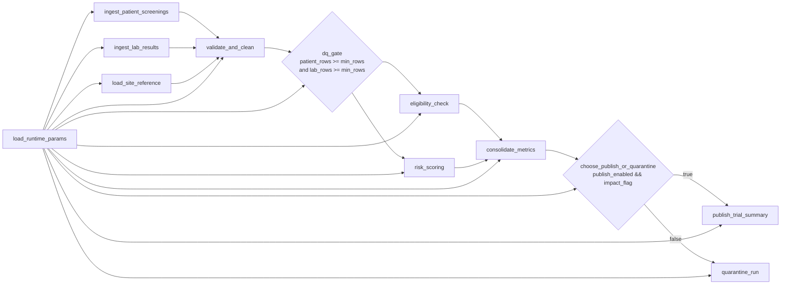

# Clinical Trial Enrollment Dagster Graph

```mermaid
flowchart LR
    params["load_runtime_params"]

    params --> ingest_ps["ingest_patient_screenings"]
    params --> ingest_lr["ingest_lab_results"]
    params --> ingest_sr["load_site_reference"]

    ingest_ps --> validate["validate_and_clean"]
    ingest_lr --> validate
    ingest_sr --> validate
    params --> validate

    validate --> dq{"dq_gate\npatient_rows >= min_rows\nand lab_rows >= min_rows"}
    params --> dq

    dq --> elig["eligibility_check"]
    dq --> risk["risk_scoring"]
    params --> elig
    params --> risk

    elig --> cons["consolidate_metrics"]
    risk --> cons
    params --> cons

    cons --> branch{"choose_publish_or_quarantine\npublish_enabled && impact_flag"}
    params --> branch

    branch -->|true| pub["publish_trial_summary"]
    branch -->|false| quar["quarantine_run"]
    params --> pub
    params --> quar
```
